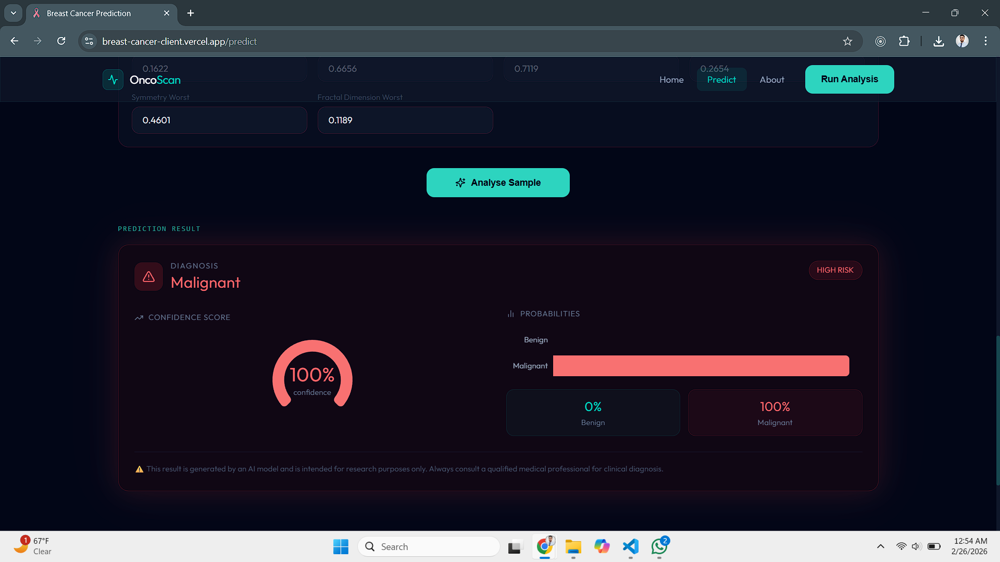

<div align="center">

# 🔬 OncoScan — Breast Cancer Prediction System

**A full-stack machine learning application that predicts breast cancer diagnosis (Malignant / Benign) from Fine Needle Aspiration biopsy measurements using Logistic Regression — deployed end-to-end as a production web application.**

[](https://breast-cancer-client.vercel.app)
[](https://breast-cancer-server.vercel.app)
[](https://www.kaggle.com/code/maqibniazi/breast-cancer-classification)
[](https://python.org)
[](https://react.dev)
[](LICENSE)

> ⚠️ **Medical Disclaimer:** This project is for educational and research purposes only. It is not a substitute for professional medical advice, diagnosis, or treatment.

</div>


## Overview

OncoScan demonstrates the complete machine learning engineering pipeline — from raw data exploration and model training through to a deployed, user-facing product. The system accepts 30 numerical measurements extracted from Fine Needle Aspiration (FNA) biopsy images and returns a real-time Malignant or Benign prediction with a confidence score and full probability breakdown.

The project was built to close the gap that exists in most academic ML work: training a model is only the beginning. This application takes a Logistic Regression classifier trained on the Wisconsin Breast Cancer Dataset and wraps it in a production-grade REST API consumed by a responsive React frontend — both deployed on Vercel.


## Model Performance

| Metric | Value |
|---|---|
| Algorithm | Logistic Regression with L2 Regularisation |
| Dataset | Wisconsin Breast Cancer Dataset (UCI / Kaggle) |
| Total Samples | 569 patient records |
| Train / Test Split | 80% / 20% with stratification |
| Feature Scaling | StandardScaler (z-score normalisation) |
| **Test Accuracy** | **97.4%** |
| **ROC-AUC Score** | **0.997** |
| Cross-Validation Mean | 97.5% ± 0.8% (5-fold) |
| Class Distribution | 357 Benign / 212 Malignant |

The full research notebook covering EDA, correlation analysis, feature importance, confusion matrix, and ROC curve analysis is available on Kaggle:
👉 [breast-cancer-classification on Kaggle](https://www.kaggle.com/code/maqibniazi/breast-cancer-classification)


## Screenshots

### Home Page


### Prediction Form
The form accepts all 30 FNA measurements grouped into Mean, Standard Error, and Worst value sections. A sample loader populates the form with real dataset cases for instant testing.


### Prediction Results
Results include a radial confidence gauge and a probability breakdown chart for both classes.

| Benign Result | Malignant Result |
|---|---|
|  |  |


## How It Works

The system follows a straightforward inference pipeline. A user submits 30 biopsy measurements through the React frontend, which sends a POST request to the Flask REST API. The API validates the input, passes the feature vector through the saved StandardScaler, runs inference on the Logistic Regression model, and returns the prediction with confidence scores in under 100ms.

```
React Frontend  →  POST /api/v1/predict  →  Flask API
                                                  ↓
                                         StandardScaler transform
                                                  ↓
                                         Logistic Regression model
                                                  ↓
                              { label, confidence, probabilities }
```

### Feature Engineering

Each of the 10 base cellular measurements (radius, texture, perimeter, area, smoothness, compactness, concavity, concave points, symmetry, fractal dimension) is represented in three statistical forms — giving 30 features total.

| Group | Description |
|---|---|
| Mean | Average value across all nuclei in the sample |
| Standard Error | Statistical uncertainty of the measurement |
| Worst | The largest (most extreme) value found in the sample |


## Tech Stack

**Machine Learning:** Python, scikit-learn, pandas, NumPy, Logistic Regression, StandardScaler

**Backend:** Flask 3.1, REST API, serverless deployment on Vercel

**Frontend:** React 19, Vite, Tailwind CSS v4, Recharts, React Router v7, Axios

**Infrastructure:** Vercel (frontend + backend), GitHub


## Project Structure

```
breast-cancer-prediction/
│
├── breast-cancer-backend/
│   ├── app/
│   │   ├── routes/          # API endpoints (health, predict, sample, features)
│   │   ├── services/        # ML inference logic and model loading
│   │   └── utils/           # Input validation and response helpers
│   ├── config/              # Dev / Prod / Test configurations
│   ├── scripts/
│   │   └── train_and_export.py   # Reproducible model training script
│   ├── breast-cancer-prediction.ipynb   # Full research notebook
│   └── requirements.txt
│
├── breast-cancer-frontend/
│   ├── src/
│   │   ├── components/      # Navbar, FeatureGroup, ResultCard, StatCard
│   │   ├── hooks/           # usePrediction — API call and state management
│   │   ├── pages/           # Home, Predict, About, 404
│   │   ├── services/        # Axios API client
│   │   └── utils/           # All 30 feature definitions and sample cases
│   └── package.json
│
└── README.md
```


## API Reference

Base URL: `https://breast-cancer-server.vercel.app`

| Endpoint | Method | Description |
|---|---|---|
| `/api/health` | GET | Health check |
| `/api/v1/features` | GET | Returns all 30 feature names and descriptions |
| `/api/v1/sample` | GET | Returns a random sample case (`?type=benign` or `?type=malignant`) |
| `/api/v1/predict` | POST | Returns prediction, confidence, and probabilities |

**Sample predict request:**
```json
{
  "features": {
    "radius_mean": 17.99,
    "texture_mean": 10.38,
    "perimeter_mean": 122.8,
    "area_mean": 1001.0,
    "...": "all 30 features"
  }
}
```

**Sample response:**
```json
{
  "success": true,
  "data": {
    "prediction": 1,
    "label": "Malignant",
    "confidence": 98.24,
    "probabilities": { "benign": 1.76, "malignant": 98.24 }
  }
}
```


## Dataset

**Wisconsin Breast Cancer Dataset** — UCI Machine Learning Repository

Features are computed from digitized images of fine needle aspirates of breast masses and describe characteristics of the cell nuclei. The dataset contains no missing values and has been widely used in classification benchmarks since its publication by Dr. William H. Wolberg at the University of Wisconsin.

Source: [Kaggle — UCI Breast Cancer Wisconsin](https://www.kaggle.com/datasets/uciml/breast-cancer-wisconsin-data)


## Local Setup

If you want to run this project locally, the backend requires Python 3.10+ and the frontend requires Node.js 18+. Clone the repository, install dependencies in each folder with `pip install -r requirements.txt` and `npm install` respectively, train the model once using `python scripts/train_and_export.py --data dataset/data.csv`, then start both servers. Full setup instructions are in each subfolder's README.


## Future Work

There are several natural extensions to this project for researchers and students who want to build on it. Comparing ensemble methods like Random Forest and XGBoost against Logistic Regression on this dataset would be a straightforward experiment. Adding dimensionality reduction via PCA to address the high multicollinearity between radius, perimeter, and area features is worth exploring. For a more ambitious extension, replacing the manual FNA measurements with a CNN that extracts features directly from raw biopsy images would bring the system closer to a real diagnostic tool.


## Contributing

Contributions are welcome from students and researchers. Fork the repository, create a feature branch, and open a pull request. Ideas include adding a model comparison dashboard, implementing SHAP values for per-prediction explainability, or extending the API to support batch predictions.


## Author

**Aqib Niazi**

[](https://github.com/AqibNiazi)
[](https://www.kaggle.com/maqibniazi)


## License

This project is licensed under the MIT License. See the [LICENSE](LICENSE) file for details.


<div align="center">

Built with ❤️ for learning and research.

If this project helped you, consider giving it a ⭐ on GitHub.

</div>