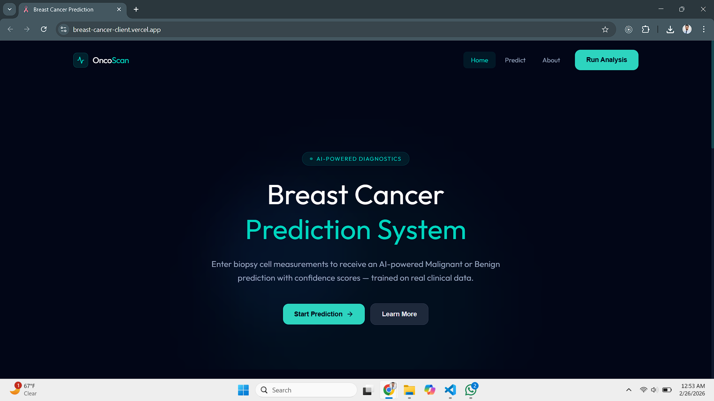
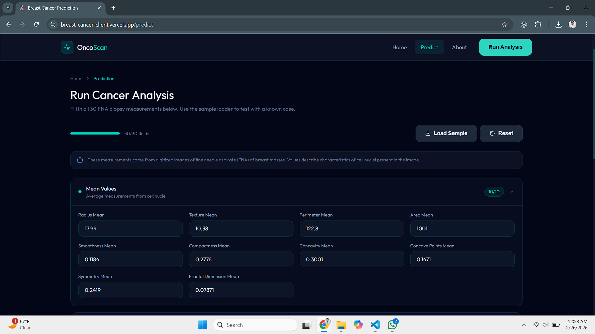
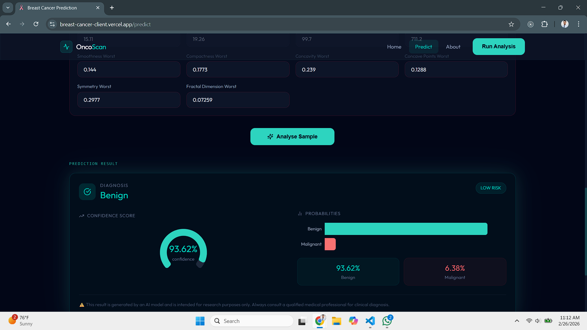
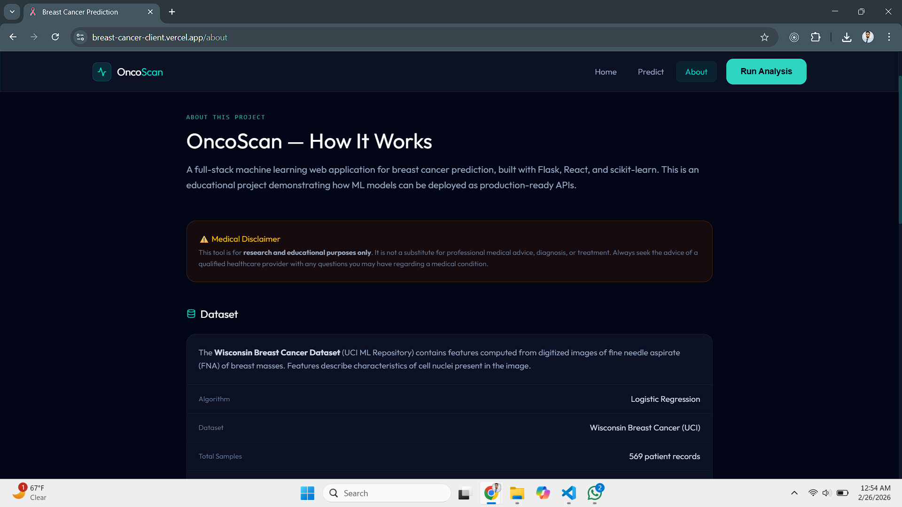

<div align="center">

# 🔬 OncoScan — Breast Cancer Prediction System

**An AI-powered full-stack web application that predicts breast cancer (Malignant / Benign) from Fine Needle Aspiration biopsy measurements using Logistic Regression.**

[](https://breast-cancer-client.vercel.app)
[](https://breast-cancer-server.vercel.app)
[](https://python.org)
[](https://react.dev)
[](LICENSE)

> ⚠️ **Medical Disclaimer:** This project is for **educational and research purposes only**. It is not a substitute for professional medical advice, diagnosis, or treatment.

</div>

---

## 📌 Table of Contents

- [Overview](#-overview)
- [Live Demo](#-live-demo)
- [Screenshots](#-screenshots)
- [How It Works](#-how-it-works)
- [Tech Stack](#-tech-stack)
- [Project Structure](#-project-structure)
- [Getting Started](#-getting-started)
  - [Backend Setup](#backend-setup)
  - [Frontend Setup](#frontend-setup)
- [API Reference](#-api-reference)
- [Model Performance](#-model-performance)
- [Dataset](#-dataset)
- [Deployment](#-deployment)
- [Contributing](#-contributing)

---

## 🧬 Overview

OncoScan is a full-stack machine learning application built to demonstrate how a trained ML model can be served as a production-grade REST API and consumed by a modern React frontend.

The system takes **30 numerical measurements** from a Fine Needle Aspiration (FNA) biopsy — such as cell radius, texture, perimeter, area, and concavity — and predicts whether the tumor is **Malignant** or **Benign**, along with a confidence score and probability breakdown.

### Key Highlights

| Feature             | Detail                                                |
| ------------------- | ----------------------------------------------------- |
| 🎯 Model Accuracy   | **97.4%** on test set                                 |
| 🧪 Training Data    | 569 patient records (Wisconsin Breast Cancer Dataset) |
| 📊 Input Features   | 30 FNA cell nucleus measurements                      |
| ⚡ Prediction Speed | < 100ms API response time                             |
| 📱 Responsive UI    | Works on mobile, tablet, and desktop                  |
| 🌐 Deployed         | Vercel (frontend + backend)                           |

---

## 🌐 Live Demo

| Service            | URL                                                                                |
| ------------------ | ---------------------------------------------------------------------------------- |
| 🖥️ Frontend        | [https://breast-cancer-client.vercel.app](https://breast-cancer-client.vercel.app) |
| ⚙️ Backend API     | [https://breast-cancer-server.vercel.app](https://breast-cancer-server.vercel.app) |
| 🔍 Sample Endpoint | [/api/v1/sample](https://breast-cancer-server.vercel.app/api/v1/sample)            |
| ❤️ Health Check    | [/api/health](https://breast-cancer-server.vercel.app/api/health)                  |

---

## 📸 Screenshots

### 🏠 Home Page

> Landing page showing model stats, feature highlights, and how the system works.



---

### 🔬 Prediction Form

> Input form with 30 FNA measurements grouped into Mean, Standard Error, and Worst sections. Includes a **Load Sample** button for instant testing.



---

### ✅ Benign Result

> Result card showing a Benign prediction with confidence gauge and probability breakdown chart.



---

### 🚨 Malignant Result

> Result card showing a Malignant prediction with high-risk indicator.


---

### 📖 About Page

> Dataset info, model specs, feature explanations, and tech stack overview.



---

## ⚙️ How It Works

```
User enters 30 FNA measurements
          │
          ▼
React Frontend (Vite + Tailwind CSS)
          │  POST /api/v1/predict
          ▼
Flask REST API (Vercel Serverless)
          │
          ▼
StandardScaler → Logistic Regression Model
          │
          ▼
{ prediction, label, confidence, probabilities }
          │
          ▼
Result displayed with gauge chart + probability bars
```

### The 3 Feature Groups

Each of the 10 base measurements (radius, texture, perimeter, area, smoothness, compactness, concavity, concave points, symmetry, fractal dimension) is captured in 3 forms — giving **30 features total**:

| Group                   | Description                                          |
| ----------------------- | ---------------------------------------------------- |
| **Mean**                | Average value across all cell nuclei in the sample   |
| **Standard Error (SE)** | Statistical spread / uncertainty of the measurement  |
| **Worst**               | The largest (most extreme) value found in the sample |

---

## 🛠️ Tech Stack

### Frontend

| Technology                                                               | Purpose                   |
| ------------------------------------------------------------------------ | ------------------------- |
| [React 19](https://react.dev)                                            | UI framework              |
| [Vite](https://vitejs.dev)                                               | Build tool & dev server   |
| [Tailwind CSS v4](https://tailwindcss.com)                               | Utility-first styling     |
| [Recharts](https://recharts.org)                                         | Radial gauge & bar charts |
| [Axios](https://axios-http.com)                                          | HTTP client               |
| [React Router v7](https://reactrouter.com)                               | Client-side routing       |
| [Lucide React](https://lucide.dev)                                       | Icon library              |
| [react toastify](https://fkhadra.github.io/react-toastify/introduction/) | Toast notifications       |

### Backend

| Technology                                               | Purpose                         |
| -------------------------------------------------------- | ------------------------------- |
| [Flask 3.1](https://flask.palletsprojects.com)           | Python REST API framework       |
| [scikit-learn](https://scikit-learn.org)                 | ML model training & inference   |
| [pandas](https://pandas.pydata.org)                      | Data loading & preprocessing    |
| [numpy](https://numpy.org)                               | Numerical computation           |
| [python-dotenv](https://pypi.org/project/python-dotenv/) | Environment variable management |
| [gunicorn](https://gunicorn.org)                         | WSGI server                     |

### Infrastructure

| Technology                   | Purpose                                 |
| ---------------------------- | --------------------------------------- |
| [Vercel](https://vercel.com) | Hosting (frontend + serverless backend) |
| [GitHub](https://github.com) | Source control                          |

---

## 📁 Project Structure

```
breast-cancer-prediction/               ← Root (this repo)
│
├── breast-cancer-backend/              ← Flask REST API
│   ├── api/
│   │   └── index.py                    # Vercel serverless entry point
│   ├── app/
│   │   ├── __init__.py                 # Flask app factory
│   │   ├── models/                     # model.pkl + scaler.pkl (git-ignored)
│   │   ├── routes/
│   │   │   ├── health.py               # GET /api/health
│   │   │   └── prediction.py           # GET /api/v1/sample, POST /api/v1/predict
│   │   ├── services/
│   │   │   └── prediction_service.py   # ML inference logic
│   │   └── utils/
│   │       ├── validators.py           # Input validation (30 features)
│   │       └── response_helpers.py     # Standardised JSON responses
│   ├── config/
│   │   └── settings.py                 # Dev / Prod / Test configurations
│   ├── scripts/
│   │   └── train_and_export.py         # One-time model training script
│   ├── tests/
│   │   └── test_prediction.py
│   ├── breast-cancer-prediction.ipynb  # EDA + model development notebook
│   ├── vercel.json                     # Vercel deployment config
│   ├── requirements.txt
│   └── run.py                          # Local dev server entry point
│
├── breast-cancer-frontend/             ← React + Vite frontend
│   ├── src/
│   │   ├── components/
│   │   │   ├── layout/
│   │   │   │   ├── Navbar.jsx          # Sticky navbar with mobile menu
│   │   │   │   └── Footer.jsx
│   │   │   ├── prediction/
│   │   │   │   ├── FeatureGroup.jsx    # Collapsible input group
│   │   │   │   ├── FeatureInput.jsx    # Single feature number input
│   │   │   │   └── ResultCard.jsx      # Prediction result with charts
│   │   │   └── ui/
│   │   │       ├── StatCard.jsx        # Stat display card
│   │   │       └── LoadingSpinner.jsx
│   │   ├── hooks/
│   │   │   └── usePrediction.js        # API call + state management hook
│   │   ├── pages/
│   │   │   ├── HomePage.jsx            # Landing page
│   │   │   ├── PredictPage.jsx         # Main prediction form
│   │   │   ├── AboutPage.jsx           # Dataset + model info
│   │   │   └── NotFoundPage.jsx
│   │   ├── services/
│   │   │   └── api.js                  # Axios instance + API methods
│   │   └── utils/
│   │       └── featureGroups.js        # All 30 feature definitions
│   ├── vercel.json                     # React Router fix for Vercel
│   ├── vite.config.js
│   └── package.json
│
├── docs/
│   └── screenshots/                    ← Add your screenshots here
│
└── README.md                           ← You are here
```

---

## 🚀 Getting Started

### Prerequisites

- Python 3.10+
- Node.js 18+
- npm or yarn

---

### Backend Setup

#### 1. Clone the repository

```bash
git clone https://github.com/AqibNiazi/breast-cancer-prediction.git
cd breast-cancer-prediction/breast-cancer-backend
```

#### 2. Create and activate virtual environment

```bash
python -m venv venv

# macOS / Linux
source venv/bin/activate

# Windows
venv\Scripts\activate
```

#### 3. Install dependencies

```bash
pip install -r requirements.txt
```

#### 4. Configure environment variables

```bash
cp .env.example .env
```

Your `.env` file should look like this:

```env
FLASK_ENV=development
SECRET_KEY=your-secret-key-here
MODEL_PATH=app/models/model.pkl
SCALER_PATH=app/models/scaler.pkl
CORS_ORIGINS=http://localhost:5173
```

#### 5. Download the dataset

Download `data.csv` from [Kaggle — Wisconsin Breast Cancer Dataset](https://www.kaggle.com/datasets/uciml/breast-cancer-wisconsin-data) and place it at:

```
breast-cancer-backend/dataset/data.csv
```

#### 6. Train the model (run once)

```bash
python scripts/train_and_export.py --data dataset/data.csv
```

This generates `app/models/model.pkl` and `app/models/scaler.pkl`.

#### 7. Start the backend server

```bash
python run.py
```

API is now running at **http://localhost:5000**

---

### Frontend Setup

#### 1. Navigate to the frontend folder

```bash
cd ../breast-cancer-frontend
```

#### 2. Install dependencies

```bash
npm install
```

#### 3. Configure environment variables

Create a `.env.local` file:

```env
VITE_API_URL=http://localhost:5000
```

#### 4. Start the development server

```bash
npm run dev
```

Frontend is now running at **http://localhost:5173**

> The Vite dev server automatically proxies `/api/*` requests to the Flask backend on port 5000.

---

## 📡 API Reference

Base URL (production): `https://breast-cancer-server.vercel.app`

### `GET /api/health`

Health check endpoint.

```json
{ "status": "ok", "message": "Breast Cancer Prediction API is running" }
```

### `GET /api/v1/features`

Returns all 30 feature names with descriptions.

### `GET /api/v1/sample`

Returns a sample malignant case from the dataset — useful for testing the UI.

### `POST /api/v1/predict`

**Request:**

```json
{
  "features": {
    "radius_mean": 17.99,
    "texture_mean": 10.38,
    "perimeter_mean": 122.8,
    "area_mean": 1001.0,
    "smoothness_mean": 0.1184,
    "...": "... (all 30 features)"
  }
}
```

**Response:**

```json
{
  "success": true,
  "data": {
    "prediction": 1,
    "label": "Malignant",
    "confidence": 98.24,
    "probabilities": {
      "benign": 1.76,
      "malignant": 98.24
    }
  }
}
```

---

## 📊 Model Performance

| Metric             | Value                                  |
| ------------------ | -------------------------------------- |
| Algorithm          | Logistic Regression                    |
| Training samples   | 455 (80%)                              |
| Test samples       | 114 (20%)                              |
| **Test Accuracy**  | **97.4%**                              |
| Feature scaling    | StandardScaler (z-score normalisation) |
| Class distribution | 357 Benign / 212 Malignant             |

The full model development process — including EDA, preprocessing, training, and evaluation — is documented in [`breast-cancer-prediction.ipynb`](breast-cancer-backend/breast-cancer-prediction.ipynb).

---

## 📂 Dataset

**Wisconsin Breast Cancer Dataset** — UCI Machine Learning Repository

- **Source:** [Kaggle](https://www.kaggle.com/datasets/uciml/breast-cancer-wisconsin-data)
- **Samples:** 569 patients
- **Features:** 30 real-valued FNA measurements per sample
- **Target:** Diagnosis — `M` (Malignant) or `B` (Benign)

Features are computed from digitized images of fine needle aspirates of breast masses. They describe characteristics of the cell nuclei present in the image — including radius, texture, perimeter, area, smoothness, compactness, concavity, concave points, symmetry, and fractal dimension.

---

## ☁️ Deployment

Both services are deployed on **Vercel** from this single monorepo.

| Service  | Root Directory            | Framework                 |
| -------- | ------------------------- | ------------------------- |
| Frontend | `breast-cancer-frontend/` | Vite                      |
| Backend  | `breast-cancer-backend/`  | Other (Python serverless) |

### Required Environment Variables

**Backend (Vercel)**

```
FLASK_ENV=production
SECRET_KEY=<strong-random-key>
MODEL_PATH=app/models/model.pkl
SCALER_PATH=app/models/scaler.pkl
CORS_ORIGINS=https://your-frontend.vercel.app
```

**Frontend (Vercel)**

```
VITE_API_URL=https://your-backend.vercel.app
```

---

## 🤝 Contributing

Contributions are welcome! If you're a student or researcher who wants to extend this project, here are some ideas:

- 🔁 Try other classifiers (Random Forest, SVM, XGBoost) and compare accuracy
- 📈 Add a model comparison dashboard
- 🖼️ Add image-based prediction using CNNs
- 📋 Add patient history / session storage
- 🌍 Add multi-language support

**To contribute:**

1. Fork the repository
2. Create a feature branch (`git checkout -b feature/your-feature`)
3. Commit your changes (`git commit -m 'feat: add your feature'`)
4. Push to your branch (`git push origin feature/your-feature`)
5. Open a Pull Request

---

## 👨‍💻 Author

**Aqib Niazi**

[](https://github.com/AqibNiazi)

---

## 📄 License

This project is licensed under the MIT License — see the [LICENSE](LICENSE) file for details.

---

<div align="center">

Built with ❤️ for learning and research.

**If this project helped you, consider giving it a ⭐ on GitHub!**

</div>
